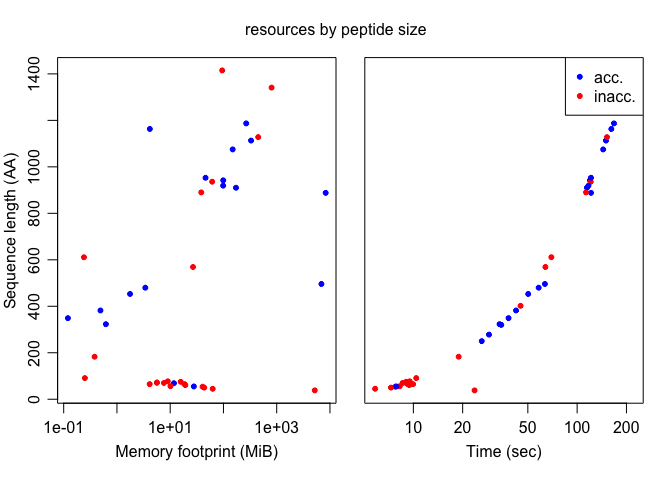

Evolutionary Scale Mode (ESM)
================
Nicholas P. Cooley, Department of Biomedical Informatics, University of
Pittsburgh
2025-06-24

# This is a work in progress…

Performing large scale structure prediction is a useful thing but
resource usage and management are non-trivial for tasks that require big
GPUs, particularly when using distributed and scavenged resources like
those provided by the Open Science Pool.

## First things first

Deploying ESM on the OSPool relies, to some extent, on a static version
of a model that can be distributed in a manner that gives a user
assurance that the model is not changing behind the scenes as they’re
pulling it from wherever it lives. Currently ESM has an open model
maintained on huggingface.

So some kind of staging of the model you want to use will generally be
an initial step. If you want to do this in a docker container, you just
need to ensure you mount a directory to send the model back to your
local environment.

``` bash
# pull a model to the docker container and dump it back to a local directory
# step one: spin up your docker container
docker run -it --rm -v <some_local_dir>:<some_container_directory> npcooley/esm:0.0.4
```

Get the model - either interactively in a python REPL or through a
script. This requires a token.

``` python
# pull a model to the docker container and dump it back to a local directory
# step two: get the model, this is just directly from the ESM folks' tutorials

from huggingface_hub import login
from esm.models.esm3 import ESM3
from esm.sdk.api import ESM3InferenceClient, ESMProtein, GenerationConfig

# Will instruct you how to get an API key from huggingface hub, make one with "Read" permission.
login()

# This will download the model weights and instantiate the model on your machine / in the container if you're using that route.
# My local machine does not have a GPU :(
model: ESM3InferenceClient = ESM3.from_pretrained("esm3_sm_open_v1").to("cpu") # or "cuda"
```

Create a tarball of the cache, move it to the mounted volume and you
will now be able to distribute the tarball as you would any normal large
file within the OSPool.

``` bash
# pull a model to the docker container and dump it back to a local directory
# step three: as of the creation of this document, the model gets stored in '$HOME/.cache'

tar czvf cache.tar.gz ${HOME}/.cache/huggingface # bog standard
# or if we're really worried about space -- disk is cheap on the OSG, but not costless, time and memory are always your biggest pain points
tar cJvf cache.tar.xz ${HOME}/.cache/huggingface # takes a lot of time, but a smaller tarball
```

From here, you should just be able to unpack this tarball into your
`.cache` directory, and ESM will find it without too much hassle. It is
good practice to scrub your token from the huggingface directory in
`.cache` before you build this tarball. And of course, you could do all
this in your local environment without using containers.

# Example 1 local testing:

## Scripts

A relatively simply python script gives us access to structure
prediction, and can be made slightly more complicated to return some
observations about resource usage.

``` bash
cat local_testing/GetStructs.py
```

    ## ###### -- generate pdb files for AA sequences ---------------------------------
    ## 
    ## import sys
    ## import warnings
    ## import torch
    ## import time
    ## import psutil
    ## # this is creating FutureWarnings
    ## with warnings.catch_warnings():
    ##     warnings.simplefilter("ignore", category=FutureWarning)
    ##     from esm.models.esm3 import ESM3
    ##     from esm.sdk.api import ESM3InferenceClient, ESMProtein, GenerationConfig
    ## 
    ## import os
    ## import argparse
    ## from Bio import SeqIO
    ## import re
    ## 
    ## 
    ## # import tqdm
    ## try:
    ##     from tqdm import tqdm
    ## except ImportError:
    ##     tqdm = lambda x: x  # Fallback if tqdm is not installed
    ## 
    ## def sanitize_id(seq_id):
    ##     return re.sub(r'\W+', '_', seq_id)
    ## 
    ## def main(fasta_file, outdir, show_progress, model_name, device):
    ##   
    ##   # untar the model to the right place, and logging in won't be necessary
    ##   # it looks for the named model in $HOME/.cache/<whatever>, that's where
    ##   # currently "esm3_sm_open_v1" is the model i know?
    ##   # model: ESM3InferenceClient = ESM3.from_pretrained("esm3_sm_open_v1").to("cpu")
    ##   # Initialize model
    ##   # this line also spits out FutureWarnings
    ##   model: ESM3InferenceClient = ESM3.from_pretrained(model_name).to(device)
    ##   records = list(SeqIO.parse(fasta_file, "fasta"))
    ## 
    ##   for record in records:
    ##     # set the prompt
    ##     prompt = str(record.seq)
    ##     
    ##     # load it into the ESM object
    ##     protein = ESMProtein(sequence=prompt)
    ##     
    ##     # cuda memory starting points
    ##     if device == "cuda":
    ##       torch.cuda.reset_peak_memory_stats()
    ##       start_mem = torch.cuda.memory_allocated()
    ##       start_peak = torch.cuda.max_memory_allocated()
    ##     elif device == "cpu":
    ##       process = psutil.Process(os.getpid())
    ##       start_mem = process.memory_info().rss
    ##     
    ##     # grab timings...
    ##     start_time = time.time()
    ##     try:
    ##       protein = model.generate(protein, GenerationConfig(track="structure", num_steps=8))
    ##     except torch.cuda.OutOfMemoryError as e:
    ##       print(f"Skipping {record.id}")
    ##     end_time = time.time()
    ##     if device == "cuda":
    ##       end_mem = torch.cuda.memory_allocated()
    ##       peak_mem = torch.cuda.max_memory_allocated()
    ##       # memory meta data in MiB:
    ##       mem_used = (end_mem - start_mem) / (1024 ** 2)
    ##       peak_used = (peak_mem - start_mem) / (1024 ** 2)
    ##     elif device == "cpu":
    ##       end_mem = process.memory_info().rss
    ##       cpu_memory_used = (end_mem - start_mem) / (1024 ** 2)
    ##     
    ##     # write out the pdb file
    ##     pdb_filename = f"{sanitize_id(record.id)}.pdb"
    ##     protein.to_pdb(pdb_filename)
    ##     
    ##     # write out the metadata
    ##     mean_plddt = protein.plddt.mean().item()
    ##     ptm_score = protein.ptm.item()
    ##     aa_count = len(prompt)
    ##     prediction_time = end_time - start_time
    ##     score_out = f"{sanitize_id(record.id)}.txt"
    ##     with open(score_out, "w") as f:
    ##       f.write(f"Mean pLDDT: {mean_plddt:.4f}\n")
    ##       f.write(f"pTM score: {ptm_score:.4f}\n")
    ##       f.write(f"seq len: {aa_count}\n")
    ##       f.write(f"time: {prediction_time:.2f}\n")
    ##       f.write(f"device: {device}\n")
    ##       if device == "cuda":
    ##         f.write(f"GPU memory used: {mem_used:.2f} MiB\n")
    ##         f.write(f"GPU peak memory during generation: {peak_used:.2f} MiB\n")
    ##       elif device == "cpu":
    ##         f.write(f"CPU memory used: {cpu_memory_used:.2f} MiB\n")
    ## 
    ## 
    ## if __name__ == "__main__":
    ##     parser = argparse.ArgumentParser(description="Predict protein structures from a FASTA file.")
    ##     parser.add_argument("fasta", help="Path to the FASTA file containing protein sequences.")
    ##     parser.add_argument("--outdir", default="predicted_structures", help="Output directory for PDB files.")
    ##     parser.add_argument("--progress", action="store_true", help="Show a progress bar during prediction.")
    ##     parser.add_argument("--model", required=True, help="ESM3 model name, e.g., esm3_sm_open_v1.")
    ##     parser.add_argument("--device", choices=["cpu", "cuda"], default="cpu", help="Device to run model on.")
    ## 
    ##     args = parser.parse_args()
    ##     main(args.fasta, args.outdir, args.progress, args.model, args.device)

Another relatively simple script that can be called inside our docker
container locally to produce some data.

``` bash
cat local_testing/UsageExample.sh
```

    ## #! /bin/bash
    ## 
    ## # example script for generating PDB files and some general data about
    ## # model resource usage
    ## 
    ## # script expects:
    ## # GetStructs.py
    ## 
    ## python tempdir/GetStructs.py tempdir/${1} --model esm3_sm_open_v1 --device cpu
    ## 
    ## # tar czf tempdir/structs.tar.gz *.pdb
    ## # tar czf tempdir/etc.tar.gz *.txt

## Example Data

I typically prefer to keep my local environment out of any work that
eventually needs to be replicable or exist in a form that can be
referenced easily for future variations. The following R code, when
executed by the knitr engine will just place some test sequences in the
working directory of this `.Rmd` file. Which is then easily referenced
by both this document and docker calls below. The `local_testing` folder
is present in this repo, though without the `cache.tar.gz` file (it’s
not a small file…).

``` r
suppressMessages(library(DECIPHER))
# a fairly randomly selected example stringset
x <- "ftp://ftp.ncbi.nlm.nih.gov/genomes/all/GCF/023/585/805/GCF_023585805.1_ASM2358580v1/GCF_023585805.1_ASM2358580v1_protein.faa.gz"
x <- readAAStringSet(x)

# smallest seqs
y1 <- head(x[order(width(x))], n = 15)
writeXStringSet(x = y1,
                filepath = "local_testing/testseqs1.fa")

# randomly selected seqs
set.seed(1986)
y2 <- sample(x, size = 15)
writeXStringSet(x = y2,
                filepath = "local_testing/testseqs2.fa")

# biggest seqs
y3 <- tail(x[order(width(x))], n = 15)
writeXStringSet(x = y3,
                filepath = "local_testing/testseqs3.fa")
```

## Docker Stuff

Spin up our docker container:

``` bash
# -dit
# d == detached state
# i == interactive, leave stdin open even AFTER the main process stops
# t == simulate terminal interface
docker run --name ESM3 \
  -v ./local_testing:/tempdir \
  -dit npcooley/esm:0.0.4
```

    ## 3af50f50fa21ba10fac39fb9de6bec9561f37ea39a03eb1c1f2d618f42f3beae

Run our scripts. This is a little bit of turtles all the way down, but
functionally, we’re just using bash scripts specifically written for the
use case of this example to call our python script (and some
housekeepers) that is written to be more generally applicable. All
inside our docker container which is a static environment while using a
*somewhat ambiguously named* cached version of a publicly available
model.

``` bash
time docker exec ESM3 tempdir/UnpackModel.sh > log.txt

time docker exec ESM3 tempdir/UsageExample.sh testseqs1.fa >> log.txt 2>&1
time docker exec ESM3 tempdir/UsageExample.sh testseqs2.fa >> log.txt 2>&1
time docker exec ESM3 tempdir/UsageExample.sh testseqs3.fa >> log.txt 2>&1

docker exec ESM3 tempdir/PackageResults.sh
```

    ## 
    ## real 1m4.727s
    ## user 0m0.028s
    ## sys  0m0.020s
    ## 
    ## real 2m48.072s
    ## user 0m0.033s
    ## sys  0m0.032s
    ## 
    ## real 12m0.415s
    ## user 0m0.065s
    ## sys  0m0.053s
    ## 
    ## real 36m58.096s
    ## user 0m0.172s
    ## sys  0m0.119s

We can then examine our resource usage from the data we’ve generated.
Because of limitations with memory tracking *in python* some memory
values may be negative, and in general these values may not be the most
accurate. R will throw a warning for that while trying to log the x-axis
if it happens, and in this case it’s fine.

``` r
suppressMessages(library(yaml))
#| dev = c('png', 'pdf'), fig.width = 7, fig.height = 3.5, fig.align = "center",

untar(tarfile = "local_testing/etc.tar.gz", exdir = tempdir())

files01 <- list.files(path = tempdir(),
                      pattern = "WP_.+\\.txt",
                      full.names = TRUE)

tab1 <- vector(mode = "list",
               length = length(files01))
for (m1 in seq_along(files01)) {
  tab1[[m1]] <- read_yaml(files01[m1])
}

tab1 <- do.call(rbind,
                tab1)
tab1 <- data.frame("ID" = unlist(regmatches(m = gregexpr(text = files01,
                                                          pattern = "WP_[^.]+"),
                                             x = files01)),
                   "mean_pLDDT" = as.numeric(tab1[, 1]),
                   "pTM" = as.numeric(tab1[, 2]),
                   "seq_len" = as.integer(tab1[, 3]),
                   "time" = as.numeric(tab1[, 4]),
                   "mem_in_MiB" = as.numeric(unlist(regmatches(m = gregexpr(pattern = "^[^ ]+",
                                                                            text = tab1[, 6]),
                                                               x = tab1[, 6]))))

layout(mat = matrix(c(1,2),
                    nrow = 1))
par(mar = c(4,3,3,0),
    mgp = c(2, .75, 0))
plot(y = tab1$seq_len,
     x = tab1$mem_in_MiB,
     pch = 20,
     log = "x",
     ylab = "Sequence length (AA)",
     xlab = "Memory footprint (MiB)",
     col = ifelse(test = tab1$mean_pLDDT > 0.8 &
                    tab1$pTM > 0.8,
                  yes = "blue",
                  no = "red"))
```

    ## Warning in xy.coords(x, y, xlabel, ylabel, log): 5 x values <= 0 omitted from
    ## logarithmic plot

``` r
par(mar = c(4,1.5,3,1.5),
    mgp = c(2, .75, 0))
plot(y = tab1$seq_len,
     x = tab1$time,
     pch = 20,
     log = "x",
     xlab = "Time (sec)",
     col = ifelse(test = tab1$mean_pLDDT > 0.8 &
                    tab1$pTM > 0.8,
                  yes = "blue",
                  no = "red"),
     yaxt = "n")
legend("topright",
       legend = c("acc.",
                  "inacc."),
       col = c("blue",
               "red"),
       pch = 20)
mtext(text = "resources by peptide size",
      outer = TRUE,
      line = -2)
```

<!-- -->

Stop and remove our container to keep our workspace nice and tidy.

``` bash
docker stop ESM3
docker rm ESM3
```

    ## ESM3
    ## ESM3

## Final Thoughts

As is stated above this readme is a bit of a work in progress. It is
important to note that this script is testing model performance *on a
cpu*, and time performance will be considerably better on almost any
gpu. If I can find the time, I’ll include the *results* of some tests on
the OSG, though that code cannot be automatically triggered through the
knitr engine like the code included in this document.

``` r
sessionInfo()
```

    ## R version 4.5.0 (2025-04-11)
    ## Platform: x86_64-apple-darwin20
    ## Running under: macOS Sonoma 14.3
    ## 
    ## Matrix products: default
    ## BLAS:   /Library/Frameworks/R.framework/Versions/4.5-x86_64/Resources/lib/libRblas.0.dylib 
    ## LAPACK: /Library/Frameworks/R.framework/Versions/4.5-x86_64/Resources/lib/libRlapack.dylib;  LAPACK version 3.12.1
    ## 
    ## locale:
    ## [1] en_US.UTF-8/en_US.UTF-8/en_US.UTF-8/C/en_US.UTF-8/en_US.UTF-8
    ## 
    ## time zone: America/New_York
    ## tzcode source: internal
    ## 
    ## attached base packages:
    ## [1] stats4    stats     graphics  grDevices utils     datasets  methods  
    ## [8] base     
    ## 
    ## other attached packages:
    ## [1] yaml_2.3.10         DECIPHER_3.5.0      Biostrings_2.77.0  
    ## [4] GenomeInfoDb_1.45.3 XVector_0.49.0      IRanges_2.43.0     
    ## [7] S4Vectors_0.47.0    BiocGenerics_0.55.0 generics_0.1.3     
    ## 
    ## loaded via a namespace (and not attached):
    ##  [1] digest_0.6.37     R6_2.6.1          fastmap_1.2.0     xfun_0.52        
    ##  [5] knitr_1.50        UCSC.utils_1.5.0  htmltools_0.5.8.1 rmarkdown_2.29   
    ##  [9] cli_3.6.5         DBI_1.2.3         compiler_4.5.0    httr_1.4.7       
    ## [13] rstudioapi_0.17.1 tools_4.5.0       evaluate_1.0.3    crayon_1.5.3     
    ## [17] jsonlite_2.0.0    rlang_1.1.6
